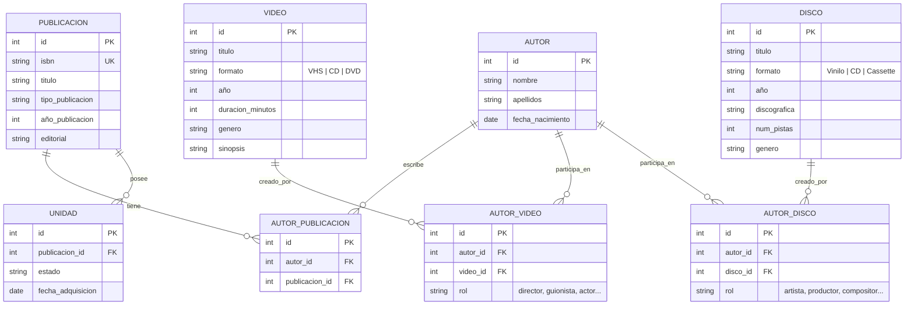

# Enunciado del EXAMEN Febrero 2026 - 2

Cada ejercicio debe guardarse dentro de tu repositorio como un commit. Para identificarlo deberás copiar el título como texto del commit. 

| Ejercicio | RA | Puntos |
| --- | --- | --- |
| 1 | RA6 | 1 p |
| 2 | RA2 | 1,75p |
| 3 | RA5, RA6| 1,5 + 1p |
| 4 | RA3, RA5 | 0,75 + 1p |  
| 5 | RA3, RA2 | 1p + 1p |

## Ejercicio 1: Configuración básica
* **RA6**  
> a. Dada la estructura de modelos y vistas, realiza los pasos necesarios para conectar la aplicación con la base de datos postgres. (0,5 punto)

Datos de conexión de la BBDD **Postgres**
> NAME     **examen**  
> HOST     **localhost**  
> PORT     **5432**     
> Username **alumno**  
> Password **alumno**  


> b. Configura e inicializa el sistema para cargar datos. Realiza el alta de un nuevo Autor usando el formulario que existe. (0,5 puntos)

## Ejercicio 2: Vistas y código embebido en ellas

* **RA2**

> a. Configura la aplicación para poder acceder con el navegador a las vistas ya existentes (listado de autores, listado de publicaciones y formularios de alta). 
(0,75 puntos)

> b. Modifica la vista de autores para que si la fecha de nacimiento del autor es anterior a 1900 se muestre este dato en color rojo (1 punto)

## Ejercicio 3: Creación de modelos

* **RA5, RA6**

> a. Crea los modelos que se necesiten para implementar el esquema que se muestran a continuación y la app socios para utilizarlos. ( 1,5 puntos)




> b. Actualiza el modelo para incluir las nuevas entidades/tablas (1 puntos)

## Ejercicio 4: Creación de vistas

* **RA3, RA5**

> a. Crea la vista que permita listar los discos. (1 punto)

> b. Crea una template para mostrar los discos y habilita su visualización (0,75 puntos)

## Ejercicio 5: Creación de formularios

* **RA2, RA3**

> a. Crea el formulario para dar de alta un disco e incluye uno ( 1 punto )

> b. Escribe una cabecera nueva que se aplique sólo a los formularios. Utiliza el siguente html ( 1 puntos )

```html
<!DOCTYPE html>
<html lang="es">
<head>
    <meta charset="UTF-8">
    <title>Biblioteca</title>
    <meta name="viewport" content="width=device-width, initial-scale=1">
    <link href="https://cdn.jsdelivr.net/npm/bootstrap@5.3.2/dist/css/bootstrap.min.css" rel="stylesheet">
</head>
<body class="bg-light">
    <nav class="navbar navbar-expand-sm navbar-dark bg-primary">
        <div class="container-fluid">
            <a class="navbar-brand" href="">Biblioteca</a>
            <button class="navbar-toggler" type="button" data-bs-toggle="collapse" data-bs-target="#menu">
                <span class="navbar-toggler-icon"></span>
            </button>
            <div class="collapse navbar-collapse" id="menu">
                <ul class="navbar-nav ms-auto">
                    <li class="nav-item"><a class="nav-link" href="">Autores</a></li>
                    <li class="nav-item"><a class="nav-link" href="">Publicaciones</a></li>
                    <li class="nav-item"><a class="nav-link" href="">Alta autor</a></li>
                    <li class="nav-item"><a class="nav-link" href="">Alta publicación</a></li>
                </ul>
            </div>
        </div>
    </nav>

    <main class="container my-4">       
        {# Cuerpo del formulario  #}
       
    </main>    
   
</body>
</html>
```

