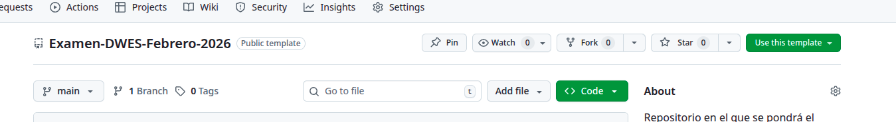

# Examen-DWES-Febrero-2026
Este es el repositorio en el que se pondrá el examen de febrero. El día del examen, realizaré un commit con el enunciado y la estructura del proyecto base de trabajo.  

Para poder trabajar con github hay que tener en cuenta que muchas veces pide autenticación con 2FA (sms, email, etc) por eso, el despliegue se abrirá el fin de semana anterior al examen para que podáis hacer el clonado del repositorio y un primer pullrequest.

## 1. Entrega del Examen

> **CUIDADO!** Si hiciste un proyecto con la versión anterior de este repositorio (antes del día del examen) Deberás generar una nueva hoy! En caso contrario no tendras los ficheros necesarios!

1. Crea TU propio repo usando este template:  
   [Botón verde "Use this template" → "Create a new repository"]



2. **IMPORTANTE**: Debe ser PRIVADO y tu nombre de usuario debe estar en el nombre del repo:  
   `examen-dwes-apellido-nombre` (ej: `examen-dwes-garcia-luis`)

3. Añádeme como colaborador (Settings → Collaborators → Add `@darioaxel`).

4. Trabaja en la rama `main`. El último commit antes de la hora límite será la versión evaluada.

5. Verificación de entrega (ejecuta ANTES de la hora límite):
   ```bash
   git log --oneline -5  # Debe mostrar tu trabajo
   git remote -v         # Debe apuntar a TU repo, no al template


## 2.  Guía paso a paso: Configurar Git en Linux para usar tu cuenta automáticamente

### Paso 1: Configurar tu identidad global (nombre y email)

Esto es obligatorio para que tus commits sean atribuidos correctamente en GitHub/GitLab.

```bash
# Configura tu nombre completo (el que aparecerá en los commits)
git config --global user.name "Tu Nombre Completo"

# Configura tu email (debe coincidir con el de tu cuenta de GitHub/GitLab)
git config --global user.email "tu.email@ejemplo.com"
```

**Verificación**:
```bash
git config --global user.name  # Muestra el nombre configurado
git config --global user.email # Muestra el email configurado
```

### Paso 2: Configurar autenticación SSH (método más seguro)

SSH es el método preferido para desarrolladores frecuentes. Evita credenciales por completo.

#### 2.1. Generar clave SSH (si no la tienes)

```bash
ssh-keygen -t ed25519 -C "tu.email@ejemplo.com" -f ~/.ssh/id_github
# o si tu servidor solo soporta RSA:
ssh-keygen -t rsa -b 4096 -C "tu.email@ejemplo.com" -f ~/.ssh/id_gitlab
```

#### 2.2. Añadir la clave al agente SSH

```bash
# Inicia el agente
eval "$(ssh-agent -s)"

# Añade tu clave privada
ssh-add ~/.ssh/id_github
```

#### 2.3. Configurar SSH para múltiples cuentas (opcional)

Edita `~/.ssh/config`:

```ssh-config
Host github.com
  HostName github.com
  User git
  IdentityFile ~/.ssh/id_github

Host gitlab.com
  HostName gitlab.com
  User git
  IdentityFile ~/.ssh/id_gitlab
```

#### 2.4. Añadir la clave pública a tu cuenta

```bash
# Copia la clave pública al portapapeles
cat ~/.ssh/id_github.pub

# Ve a GitHub/GitLab → Settings → SSH Keys → New SSH Key → Pega el contenido
```

#### 2.5. Actualizar URLs de repos existentes

```bash
# Cambia de HTTPS a SSH
git remote set-url origin git@github.com:usuario/repositorio.git
```

2. Guía paso a paso: Configurar Git en Linux para usar tu cuenta automáticamente --> Anthony Mauricio Ibarra Valencia