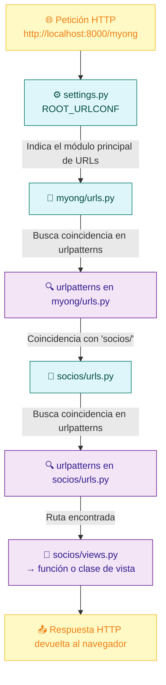

# 🐍 Anexo II: Django Básico 2 (URLs, Vistas y Separación de Lógica en Django)

## 1. Introducción

En la anterior videotutoría - anexo, nos quedamos ejecutando nuestro proyecto `Django`, que contiene una aplicación `socios`. 

En este **Anexo II** daremos un paso más: aprenderás a **registrar rutas (URLs)**, **crear vistas básicas** que muestren información y **separar la lógica del controlador y la presentación**, siguiendo el patrón **Modelo–Vista–Controlador (MVC)** que Django implementa como **Modelo–Vista–Template (MVT)**.

## 2. Las URLs en Django

Las **URLs** en Django son el punto de entrada de cada solicitud HTTP.
El sistema de enrutamiento se define en archivos llamados `urls.py`, donde se asocian rutas específicas con funciones o clases que gestionan las solicitudes, llamadas **vistas**.

Por ejemplo, cuando un usuario visita la dirección `http://localhost:8000/socios/`, Django busca una coincidencia en sus patrones de URL y ejecuta la vista correspondiente.

### 2.1. Archivo `urls.py` del proyecto

Dentro de la carpeta del proyecto principal (`myong_proyect/`), existe un archivo `urls.py` que gestiona las rutas globales del sitio.
Abramos el archivo `myong_proyect/urls.py` y añadamos una línea para incluir las rutas de nuestra aplicación `socios`:

```python
from django.contrib import admin
from django.urls import path, include

urlpatterns = [
    path('admin/', admin.site.urls),
    # Añadimos las URLs de la aplicación socios
    path('socios/', include('socios.urls')),
]
```

> **Nota:** El uso de `include()` permite que cada aplicación defina sus propias rutas de forma independiente, manteniendo el código organizado y modular.

### 2.2. Archivo `urls.py` de la aplicación `socios`

Cada aplicación debe tener su propio archivo `urls.py`.
Si no lo tienes aún, créalo en la carpeta `socios`:

```
myong_proyect/
├── socios/
│   ├── urls.py   ← lo creamos aquí
│   ├── views.py
│   ├── models.py
│   └── ...
```

El contenido de este archivo definirá las rutas específicas de la aplicación:

```python
from django.urls import path

urlpatterns = [
    path('', index, name='index'),  # Página principal de socios
    path('detalle/', detalle_socio, name='detalle_socio'),  # Detalle del socio
]
```


## 3. Creación de una vista básica

Las **vistas** son las encargadas de recibir la solicitud HTTP y devolver una respuesta (normalmente, una página HTML).

### 3.1. Primera vista: `index`

Edita el archivo `socios/views.py` y crea una vista básica que devuelva texto plano:

```python
from django.http import HttpResponse

def index(request):
    return HttpResponse("Bienvenido al módulo de socios de MyONG.")
```

Si ejecutas el servidor:

```bash
python manage.py runserver
```

Y accedes desde el navegador a:

```
http://127.0.0.1:8000/socios/
```

verás el mensaje “Bienvenido al módulo de socios de MyONG.”
> ¡Tu primera vista está funcionando!

## 4. Mostrar datos de un socio (sin base de datos)

Como todavía no hemos definido ni migrado modelos, simularemos los datos de un socio **directamente desde la vista**, usando un diccionario de Python.

### 4.1. Ejemplo de vista con datos estáticos

Edita `views.py` para incluir la siguiente función:

```python
from django.shortcuts import render

def detalle_socio(request):
    socio = {
        'nombre': 'Ana',
        'apellidos': 'Martínez López',
        'dni': '12345678A',
        'direccion': 'Calle Mayor, 12, 2ºA',
        'ciudad': 'Valdepeñas',
        'provincia': 'Ciudad Real',
        'pais': 'España',
    }
    return render(request, 'socios/detalle.html', {'socio': socio})
```

En esta vista:

* Se crea un diccionario `socio` con datos de ejemplo.
* Se usa la función `render()` para combinar estos datos con una **plantilla HTML**, que se mostrará al usuario.

## 5. Creación de la plantilla (vista en MVT)

Ahora crearemos el archivo HTML para mostrar la información.
En Django, las plantillas se almacenan en una carpeta llamada `templates`.

Estructura recomendada:

```
myong_proyect/
├── socios/
│   ├── templates/
│   │   └── socios/
│   │       └── detalle.html
```

El contenido de `detalle.html` podría ser:

```html
<!DOCTYPE html>
<html lang="es">
<head>
    <meta charset="UTF-8">
    <title>Detalle del Socio</title>
</head>
<body>
    <h1>Detalle del socio</h1>
    <ul>
        <li><strong>Nombre:</strong> {{ socio.nombre }}</li>
        <li><strong>Apellidos:</strong> {{ socio.apellidos }}</li>
        <li><strong>DNI:</strong> {{ socio.dni }}</li>
        <li><strong>Dirección:</strong> {{ socio.direccion }}</li>
        <li><strong>Ciudad:</strong> {{ socio.ciudad }}</li>
        <li><strong>Provincia:</strong> {{ socio.provincia }}</li>
        <li><strong>País:</strong> {{ socio.pais }}</li>
    </ul>
</body>
</html>
```

La sintaxis `{{ socio.nombre }}` pertenece al **sistema de plantillas de Django**, que permite insertar valores dinámicos de forma segura.


## 6. Separación de lógica y presentación

Django sigue el patrón **MVT (Modelo–Vista–Template)**, una variante del **MVC (Modelo–Vista–Controlador)**.
Esto permite mantener la **lógica de negocio** (qué datos se muestran) separada de la **lógica de presentación** (cómo se muestran).

| Componente MVT | Equivalente en MVC | Función                                                       |
| -------------- | ------------------ | ------------------------------------------------------------- |
| **Model**      | Modelo             | Define la estructura de los datos.                            |
| **View**       | Controlador        | Contiene la lógica que decide qué datos se envían al usuario. |
| **Template**   | Vista              | Define cómo se muestran los datos (HTML, CSS, etc.).          |

### 6.1. Ejemplo práctico

Imaginemos que queremos calcular si un socio tiene el pago al día.
Podemos colocar esta lógica en la vista:

```python
def detalle_socio(request):
    socio = {
        'nombre': 'Ana',
        'apellidos': 'Martínez López',
        'cuota_pagada': True
    }

    mensaje = "Cuota al día" if socio['cuota_pagada'] else "Cuota pendiente"
    
    return render(request, 'socios/detalle.html', {'socio': socio, 'mensaje': mensaje})
```

Y en la plantilla mostraríamos:

```html
<p><strong>Estado de la cuota:</strong> {{ mensaje }}</p>
```

De esta forma:

* La **vista (views.py)** decide qué datos se calculan o se muestran.
* La **plantilla (detalle.html)** se limita a presentarlos, sin lógica de negocio.


## 7. Diagrama 



