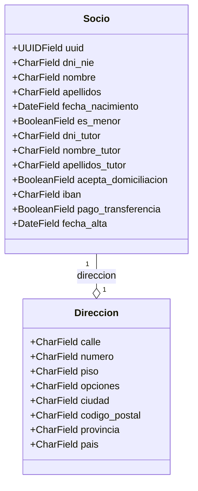

# 🐍 Anexo III: Modelos en Django

## 1. Introducción
Las aplicaciones web de Django acceden y administran los datos a través de objetos de Python a los que se hace referencia como modelos. Los modelos definen la estructura de los datos almacenados, incluidos los tipos de campo y los atributos de cada campo, como su tamaño máximo, valores predeterminados, lista de selección de opciones, texto de ayuda para la documentación, texto de etiqueta para formularios, etc. La definición del modelo es independiente de la base de datos subyacente. puede elegir una de entre varias como parte de la configuración de su proyecto. Una vez que haya elegido la base de datos que desea usar, no necesita hablar directamente con ella. Simplemente escriba la estructura de su modelo y algo de código, y Django se encargará de todo el trabajo sucio, al comunicarse con la base de datos por usted.


## 2. Modelos en Django (Ejemplo: aplicación *myOng*)

Las aplicaciones web de **[Django](https://docs.djangoproject.com/es/stable/)** acceden y administran los datos a través de **objetos de Python** llamados **modelos**.
Un modelo define la **estructura de los datos** que se almacenan en la base de datos: qué campos tiene, sus tipos de datos, valores por defecto, etiquetas, texto de ayuda, relaciones con otros modelos, etc.

::: note
   En nuestra aplicación **myOng**, usaremos modelos como `Socio`, `Direccion` o `Ciudad`.
:::

### 2.1. ¿Qué hace un modelo?

Un modelo de Django describe los datos y su comportamiento **sin depender de la base de datos**.
Django se encarga de traducir el modelo a tablas SQL, gestionar consultas, inserciones, relaciones, y más.
En este ejemplo vamos a crear una estructura de tipo `Socio-Direccion` donde un socio de una organización puede tener una única dirección (por ahora ;-) ) El diseño lo realizamos usando `mermaidjs`y se vería así:



Por ejemplo, el modelo `Socio` podría representarse así:

```python
from django.db import models
import uuid

class Socio(models.Model):
    id = models.UUIDField(primary_key=True, default=uuid.uuid4, editable=False)
    dni = models.CharField(max_length=15, unique=True, help_text="DNI o NIE del socio")
    nombre = models.CharField(max_length=50)
    apellidos = models.CharField(max_length=100)
    fecha_nacimiento = models.DateField()
    acepta_domiciliacion = models.BooleanField(default=False)
    iban = models.CharField(max_length=34, blank=True, null=True, help_text="IBAN para domiciliación (opcional)")
    fecha_alta = models.DateField(auto_now_add=True)

    def __str__(self):
        return f"{self.nombre} {self.apellidos}"
```

### 2.2. Estructura de los modelos

Los modelos se definen en el archivo `models.py` de cada aplicación y heredan de `django.db.models.Model`.

Ejemplo simplificado de un modelo `Direccion` relacionado con `Socio`:

```python
class Direccion(models.Model):
    calle = models.CharField(max_length=100)
    numero = models.CharField(max_length=10)
    piso = models.CharField(max_length=10, blank=True)
    otras_opciones = models.CharField(max_length=50, blank=True, help_text="Escalera, bis, etc.")
    ciudad = models.ForeignKey("Ciudad", on_delete=models.CASCADE)
    socio = models.OneToOneField("Socio", on_delete=models.CASCADE)

    def __str__(self):
        return f"{self.calle}, {self.numero} ({self.ciudad})"
```

### 2.3. Tipos de campos más comunes

Cada campo del modelo define una **columna** en la base de datos y tiene un **tipo de dato**.

| Tipo de campo     | Uso en myOng                                                  | Enlace                                                                                         |
| ----------------- | ------------------------------------------------------------- | ---------------------------------------------------------------------------------------------- |
| `CharField`       | Para nombres, apellidos, DNI, calle, etc.                     | [CharField](https://docs.djangoproject.com/es/stable/ref/models/fields/#charfield)             |
| `TextField`       | Para textos largos (comentarios, observaciones).              | [TextField](https://docs.djangoproject.com/es/stable/ref/models/fields/#textfield)             |
| `IntegerField`    | Para números enteros (edad, número de puerta).                | [IntegerField](https://docs.djangoproject.com/es/stable/ref/models/fields/#integerfield)       |
| `DateField`       | Para fechas (`fecha_nacimiento`, `fecha_alta`).               | [DateField](https://docs.djangoproject.com/es/stable/ref/models/fields/#datefield)             |
| `BooleanField`    | Para opciones sí/no (`acepta_domiciliacion`).                 | [BooleanField](https://docs.djangoproject.com/es/stable/ref/models/fields/#booleanfield)       |
| `UUIDField`       | Identificador único de cada socio.                            | [UUIDField](https://docs.djangoproject.com/es/stable/ref/models/fields/#uuidfield)             |
| `ForeignKey`      | Relación muchos-a-uno (una ciudad puede tener varios socios). | [ForeignKey](https://docs.djangoproject.com/es/stable/ref/models/fields/#foreignkey)           |
| `OneToOneField`   | Relación uno-a-uno (un socio tiene una dirección).            | [OneToOneField](https://docs.djangoproject.com/es/stable/ref/models/fields/#onetoonefield)     |
| `ManyToManyField` | Si en el futuro un socio pertenece a varios grupos.           | [ManyToManyField](https://docs.djangoproject.com/es/stable/ref/models/fields/#manytomanyfield) |

### 2.4. Argumentos comunes de los campos

Ejemplo dentro del modelo `Ciudad`:

```python
class Ciudad(models.Model):
    nombre = models.CharField(max_length=100, verbose_name="Ciudad")
    codigo_postal = models.CharField(max_length=10)
    provincia = models.CharField(max_length=100)
    pais = models.CharField(max_length=100, default="España")

    class Meta:
        ordering = ["nombre"]
        verbose_name_plural = "Ciudades"
```

| Argumento        | Descripción                         | Enlace                                                                                   |
| ---------------- | ----------------------------------- | ---------------------------------------------------------------------------------------- |
| `max_length`     | Longitud máxima (para `CharField`). | [max_length](https://docs.djangoproject.com/es/stable/ref/models/fields/#max-length)     |
| `help_text`      | Texto de ayuda en formularios.      | [help_text](https://docs.djangoproject.com/es/stable/ref/models/fields/#help-text)       |
| `verbose_name`   | Nombre legible del campo.           | [verbose_name](https://docs.djangoproject.com/es/stable/ref/models/fields/#verbose-name) |
| `default`        | Valor por defecto.                  | [default](https://docs.djangoproject.com/es/stable/ref/models/fields/#default)           |
| `blank` / `null` | Permiten valores vacíos o nulos.    | [blank](https://docs.djangoproject.com/es/stable/ref/models/fields/#blank)               |
| `choices`        | Lista de opciones predefinidas.     | [choices](https://docs.djangoproject.com/es/stable/ref/models/fields/#choices)           |
| `primary_key`    | Clave primaria del modelo.          | [primary_key](https://docs.djangoproject.com/es/stable/ref/models/fields/#primary-key)   |

### 2.5. Relaciones entre modelos

En **myOng**, hay varios tipos de relaciones:

| Tipo de relación                        | Ejemplo                    | Descripción                                              |
| --------------------------------------- | -------------------------- | -------------------------------------------------------- |
| **Uno a uno (`OneToOneField`)**         | Un socio → una dirección   | Cada socio tiene una única dirección asociada.           |
| **Uno a muchos (`ForeignKey`)**         | Una ciudad → muchos socios | Varios socios pueden vivir en la misma ciudad.           |
| **Muchos a muchos (`ManyToManyField`)** | Un socio ↔ varios grupos   | En el futuro, un socio puede pertenecer a varios grupos. |


### 2.6. Metadatos del modelo

Los metadatos se declaran dentro de la clase interna `Meta`.
Sirven para definir comportamientos del modelo, como el **orden por defecto** o el **nombre en el admin**.

```python
class Socio(models.Model):
    ...
    class Meta:
        ordering = ["apellidos", "nombre"]
        verbose_name_plural = "Socios"
```

### 2.7. Métodos del modelo

Los modelos pueden incluir métodos personalizados.
Los dos más habituales son:

#### 2.7.1. `__str__()`

Representa el objeto en texto legible (por ejemplo, en el panel de administración):

```python
def __str__(self):
    return f"{self.nombre} {self.apellidos}"
```

#### 2.7.2. `get_absolute_url()`

Devuelve la URL para acceder al detalle del objeto en el sitio web.

```python
from django.urls import reverse

def get_absolute_url(self):
    return reverse('socio-detail', args=[str(self.id)])
```


