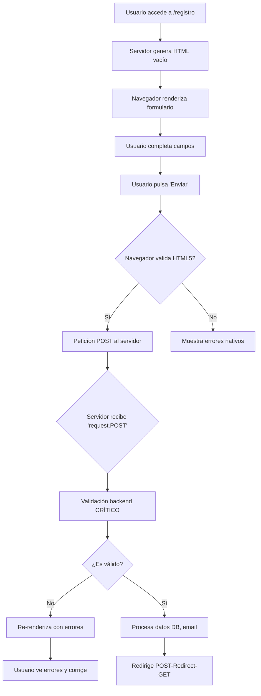

# 🐍 Anexo V: Formularios en Django para la aplicación *myOng*

## 1. Introducción: ¿Por qué los formularios son la esencia de la web interactiva?

Los formularios son el puente entre el usuario y el servidor. Sin ellos, la web sería solo un medio de lectura. Cada vez que inicias sesión, publicas un comentario o compras online, estás usando un formulario. Dominar su creación y validación es fundamental para cualquier desarrollador web.

A continuación trataremos los siguientes puntos:
- La **lógica HTTP** que hay detrás (request/response, métodos, CSRF)
- El **ciclo de vida completo**: desde que el usuario pulsa "Enviar" hasta que los datos se guardan
- La **validación**: primera línea de defensa contra datos maliciosos o erróneos
- **Django Forms**: cómo abstrae y simplifica todo este proceso
- **Crispy Forms**: la herramienta que transforma formularios feos en interfaces profesionales

## 2. Fundamentos Web: La Lógica Detrás de Todo Formulario

Antes de ver código Django, entendamos lo que ocurre realmente bajo el capó.

### 2.1 Métodos HTTP: GET vs POST

```python
# Ejemplo conceptual: ¿qué método usar?
# ❌ GET (datos en la URL) - Para búsquedas, filtros
https://tienda.com/buscar?q=iphone&max=500

# ✅ POST (datos en el cuerpo) - Para acciones que cambian datos
# Los datos NO se ven en la URL
# El navegador avisa al reenviar
```

| Característica | GET | POST |
|----------------|-----|------|
| **Visibilidad** | Datos en URL | Datos en cuerpo de la petición |
| **Seguridad** | Muy baja (se guarda en historial) | Alta (no se cachea) |
| **Idempotencia** | Sí (no modifica datos) | No (crea/actualiza datos) |
| **Límite de tamaño** | ~2048 caracteres | Ilimitado (configurable) |
| **Uso Django** | `request.GET` | `request.POST` |

### 2.2 Ciclo de Vida de un Formulario Web



::: caution
**Regla de Oro**: **NUNCA** confíes solo en la validación del navegador. Siempre valida en el backend.
:::

### 2.3 Validaciones: Multiples Capas de Defensa

```html
# 1. Validación HTML5 (navegador)
<input type="email" required maxlength="50">
```

```javascript
# 2. Validación JavaScript (UX mejorado)
if (!email.includes('@')) {
    mostrarError("Email inválido");
}
```

```python
# 3. Validación Backend (OBLIGATORIA)
# Django Forms hace esto automáticamente
def clean_email(self):
    if "spam" in self.data:
        raise ValidationError("No se permiten emails de spam")
```

### 2.4 CSRF: El Token de Seguridad

```html
<!-- Django inserta esto automáticamente -->
<form method="post">
    
    <!-- Sin este token, Django rechaza la petición -->
</form>
```

**¿Por qué?** Protege contra ataques donde un sitio malicioso envía peticiones en tu nombre. Django verifica que el token coincida con la sesión del usuario.

## 3. Formularios en Django: De la Teoría a la Práctica

Django abstrae todo lo anterior en una API elegante. Veamos los 3 enfoques principales.

### 3.1 Enfoque 1: HTML Manual (para entender la base)

```python
# views.py - ¡NO recomendado en producción!
def registro_manual(request):
    if request.method == 'POST':
        # ¡VALIDACIÓN MANUAL TEDIOSA Y PROPENSA A ERRORES!
        nombre = request.POST.get('nombre', '')
        email = request.POST.get('email', '')
        
        errores = []
        if len(nombre) < 3:
            errores.append("Nombre muy corto")
        if "@" not in email:
            errores.append("Email inválido")
        
        if not errores:
            # Guardar en BD...
            return redirect('exito')
            
        return render(request, 'registro.html', {
            'errores': errores,
            'datos': request.POST
        })
    
    return render(request, 'registro.html')
```

::: danger
**Problemas**: Repetitivo, no reutilizable, fácil olvidar validaciones, inseguro.
:::

### 3.2 Enfoque 2: `django.forms.Form` (Formularios Personalizados)

```python
# forms.py
from django import forms
from django.core.validators import MinLengthValidator

class ContactoForm(forms.Form):
    # Cada campo = tipo de dato + validaciones
    nombre = forms.CharField(
        max_length=100,
        validators=[MinLengthValidator(3)],
        widget=forms.TextInput(attrs={
            'class': 'form-control',
            'placeholder': 'Tu nombre completo'
        })
    )
    
    email = forms.EmailField(
        widget=forms.EmailInput(attrs={'class': 'form-control'})
    )
    
    asunto = forms.ChoiceField(
        choices=[
            ('consulta', 'Consulta general'),
            ('soporte', 'Soporte técnico'),
            ('facturacion', 'Facturación')
        ]
    )
    
    mensaje = forms.CharField(
        widget=forms.Textarea(attrs={'rows': 5, 'class': 'form-control'})
    )
    
    # Validación específica de un campo
    def clean_email(self):
        email = self.cleaned_data['email']
        if "temporal.com" in email:
            raise forms.ValidationError("No se permiten emails temporales")
        return email
    
    # Validación de múltiples campos
    def clean(self):
        cleaned_data = super().clean()
        asunto = cleaned_data.get('asunto')
        mensaje = cleaned_data.get('mensaje')
        
        if asunto == 'soporte' and len(mensaje) < 20:
            self.add_error('mensaje', 'Mensaje muy breve para soporte')
            
        return cleaned_data
```
```python
# views.py
from django.shortcuts import render, redirect
from .forms import ContactoForm

def contacto(request):
    # GET: form vacío | POST: form con datos
    form = ContactoForm(request.POST or None)
    
    if request.method == 'POST' and form.is_valid():
        # Datos limpios y validados
        nombre = form.cleaned_data['nombre']
        email = form.cleaned_data['email']
        
        # Enviar email, guardar en DB...
        enviar_email_contacto(nombre, email)
        
        # ¡IMPORTANTE! Redirige tras éxito (PRG pattern)
        return redirect('contacto_exito')
    
    # Renderiza form vacío O con errores
    return render(request, 'contacto.html', {'form': form})
```
```html
# template contacto.html
<form method="post" novalidate>
    
    {{ form.nombre.label_tag }}
    {{ form.nombre }}
    {{ form.nombre.errors }}
    
    {{ form.email.label_tag }}
    {{ form.email }}
    {{ form.email.errors }}
    
    <button type="submit">Enviar</button>
</form>
```

### 3.3 Enfoque 3: `django.forms.ModelForm` (La Opción Más Común)

```python
# models.py
from django.db import models
from django.core.validators import RegexValidator

class Estudiante(models.Model):
    nombre = models.CharField(max_length=100)
    email = models.EmailField(unique=True)
    dni = models.CharField(
        max_length=9,
        validators=[
            RegexValidator(r'^\d{8}[A-Z]$', 'DNI inválido')
        ]
    )
    fecha_nacimiento = models.DateField()
    activo = models.BooleanField(default=True)
    
    def __str__(self):
        return self.nombre
```
```python
# forms.py
from django import forms
from .models import Estudiante

class EstudianteForm(forms.ModelForm):
    # Campo extra que NO está en el modelo
    confirmar_email = forms.EmailField(
        label="Confirmar email",
        widget=forms.EmailInput(attrs={'class': 'form-control'})
    )
    
    class Meta:
        model = Estudiante
        fields = ['nombre', 'email', 'dni', 'fecha_nacimiento', 'activo']
        
        # Excluir campos
        # exclude = ['activo']
        
        widgets = {
            'nombre': forms.TextInput(attrs={
                'class': 'form-control',
                'placeholder': 'Apellidos, Nombre'
            }),
            'fecha_nacimiento': forms.DateInput(attrs={
                'type': 'date',
                'class': 'form-control'
            })
        }
        
        labels = {
            'dni': 'DNI (formato: 12345678Z)',
        }
        
        help_texts = {
            'email': 'Usa tu email institucional si tienes uno',
        }
    
    # Validación personalizada
    def clean_confirmar_email(self):
        email = self.cleaned_data.get('email')
        confirmar = self.cleaned_data.get('confirmar_email')
        
        if email != confirmar:
            raise forms.ValidationError("Los emails no coinciden")
        return confirmar
```
```python
# views.py
def crear_estudiante(request):
    form = EstudianteForm(request.POST or None)
    
    if form.is_valid():
        # Guarda en BD y devuelve la instancia
        estudiante = form.save()
        
        # O procesar antes de guardar
        # estudiante = form.save(commit=False)
        # estudiante.creado_por = request.user
        # estudiante.save()
        
        return redirect('detalle_estudiante', pk=estudiante.pk)
    
    return render(request, 'estudiante_form.html', {'form': form})
```

### 3.4 Trabajando con Errores en Plantillas

```html
<!-- templates/estudiante_form.html -->
<form method="post" novalidate>
    
    
    <!-- Mostrar errores generales del formulario -->
    
        <div class="alert alert-danger">
            {{ form.non_field_errors }}
        </div>
    
    
    <!-- Iterar por todos los campos -->
    
        <div class="mb-3">
            {{ field.label_tag }}
            {{ field }}
            
            <!-- Errores específicos del campo -->
            
                <div class="invalid-feedback d-block">
                    {{ field.errors }}
                </div>
            
            
            <!-- Texto de ayuda -->
            
                <small class="form-text text-muted">
                    {{ field.help_text }}
                </small>
            
        </div>
    
    
    <button type="submit" class="btn btn-primary">Guardar</button>
</form>
```

## 4. CRISPY FORMS: Librerías externas que nos ahorran trabajo

Crispy Forms es una librería que renderiza formularios Django con clases CSS de frameworks frontend (Bootstrap, Tailwind, Bulma) automáticamente.

### 4.1 Instalación y Configuración

```bash
pip install django-crispy-forms crispy-bootstrap5
```

```python
# settings.py
INSTALLED_APPS = [
    ...
    'crispy_forms',
    "crispy_bootstrap5",
]

CRISPY_ALLOWED_TEMPLATE_PACKS = "bootstrap5"
CRISPY_TEMPLATE_PACK = "bootstrap5"
```

### 4.2 Ejemplo Básico: De 0 a Bootstrap 5 en 2 líneas

```python
# forms.py
from crispy_forms.helper import FormHelper
from crispy_forms.layout import Layout, Submit, Row, Column

class ContactoCrispyForm(forms.Form):
    nombre = forms.CharField(max_length=100)
    email = forms.EmailField()
    mensaje = forms.CharField(widget=forms.Textarea)
    
    def __init__(self, *args, **kwargs):
        super().__init__(*args, **kwargs)
        
        # CRÍTICO: Configura el helper
        self.helper = FormHelper()
        self.helper.form_method = 'post'
        self.helper.form_class = 'form-horizontal'
        self.helper.label_class = 'col-lg-2'
        self.helper.field_class = 'col-lg-8'
        
        # Layout personalizado
        self.helper.layout = Layout(
            Row(
                Column('nombre', css_class='col-md-6'),
                Column('email', css_class='col-md-6'),
            ),
            'mensaje',
            Submit('submit', 'Enviar', css_class='btn btn-primary')
        )

# template.html - ¡Solo necesitas 2 líneas!


<form method="post">
    
    
</form>
```

### 4.3 Layout Avanzado: Diseños Complejos

```python
# forms.py
from crispy_forms.bootstrap import TabHolder, Tab, Accordion, AccordionGroup

class RegistroAvanzadoForm(forms.Form):
    # ... campos ...
    
    def __init__(self, *args, **kwargs):
        super().__init__(*args, **kwargs)
        self.helper = FormHelper()
        self.helper.form_tag = False  # No renderizar <form> tag
        
        self.helper.layout = Layout(
            TabHolder(
                Tab('Datos Personales',
                    Row(
                        Column('nombre', css_class='col-md-6'),
                        Column('apellidos', css_class='col-md-6'),
                    ),
                    'email',
                ),
                Tab('Dirección',
                    'direccion',
                    Row(
                        Column('ciudad', css_class='col-md-8'),
                        Column('cp', css_class='col-md-4'),
                    ),
                )
            ),
            Accordion(
                AccordionGroup("Opciones Avanzadas",
                    'activo',
                    'newsletter',
                    active=False,  # Collapsed por defecto
                )
            ),
            Submit('submit', 'Finalizar Registro', css_class='btn-success mt-3')
        )
```

### 4.4 Integración con ModelForm

```python
# forms.py
class EstudianteCrispyForm(forms.ModelForm):
    class Meta:
        model = Estudiante
        fields = '__all__'
    
    def __init__(self, *args, **kwargs):
        super().__init__(*args, **kwargs)
        self.helper = FormHelper()
        self.helper.form_tag = True
        self.helper.layout = Layout(
            Row(
                Column('nombre', css_class='col-md-6'),
                Column('email', css_class='col-md-6'),
            ),
            Row(
                Column('dni', css_class='col-md-4'),
                Column('fecha_nacimiento', css_class='col-md-4'),
                Column('activo', css_class='col-md-4'),
            ),
            Submit('submit', 'Guardar Estudiante', css_class='btn-primary')
        )
```
```python
# views.py - No cambia nada en la lógica
def crear_estudiante_crispy(request):
    form = EstudianteCrispyForm(request.POST or None)
    if form.is_valid():
        form.save()
        return redirect('lista_estudiantes')
    return render(request, 'form_crispy.html', {'form': form})
```

```html
# template form_crispy.html




<h2>Nuevo Estudiante</h2>

<form method="post">
    
    
</form>

```

## 5. Buenas Prácticas y Patrones Clave

```python
# ✅ SÍ: Usar POST-Redirect-GET
if form.is_valid():
    form.save()
    return redirect('success_url')  # ¡SIEMPRE!

# ❌ NO: Renderizar éxito en la misma vista
if form.is_valid():
    form.save()
    return render(request, 'success.html')  # ¡MAL! Recarga duplica

# ✅ SÍ: Usar django-debug-toolbar en desarrollo
# Instala para ver las queries y rendimiento

# ✅ SÍ: Personaliza widgets para UX
widgets = {
    'password': forms.PasswordInput(),
    'color': forms.TextInput(attrs={'type': 'color'}),
    'numero_telefono': forms.TextInput(attrs={'type': 'tel'}),
}

# ✅ SÍ: Agrupa lógica en forms.py, NO en views.py
# El formulario debe ser auto-validable y reutilizable

# ✅ SÍ: Usa class-based views para CRUD
from django.views.generic import CreateView

class EstudianteCreateView(CreateView):
    model = Estudiante
    form_class = EstudianteCrispyForm
    template_name = 'form_crispy.html'
    success_url = '/estudiantes/'
```

## 6. Checklist de Implementación

Para cada formulario que crees, verifica:

- [ ] ¿Usas `method="post"` para acciones que modifican datos?
- [ ] ¿Incluyes `` en todos los formularios POST?
- [ ] ¿Validas SIEMPRE en el backend, aunque tengas JS?
- [ ] ¿Usas `form.is_valid()` antes de procesar?
- [ ] ¿Rediriges tras guardar con éxito (PRG)?
- [ ] ¿Muestras errores específicos de cada campo?
- [ ] ¿Has instalado Crispy Forms para un UI profesional?
- [ ] ¿Los forms están en `forms.py`, no en `views.py`?
- [ ] ¿Usas `clean_<campo>()` para validaciones específicas?
- [ ] ¿Usas `clean()` para validaciones que cruzan campos?


## 7. Ejercicios Prácticos Propuestos

1. **Formulario de Registro**: Crea un formulario con validación de email duplicado usando `clean_email()`
2. **Formulario con Fechas**: Añade validación para que la fecha de nacimiento no sea futura
3. **Formulario de Contacto con Captcha**: Integra `django-recaptcha`
4. **Formulario con Archivos**: Añade `forms.FileField()` y configura `MEDIA_URL`
5. **Formulario Inline**: Usa `inlineformset_factory` para crear múltimos objetos relacionados

